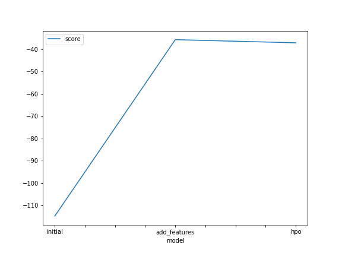
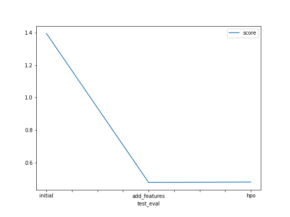

# Report: Predict Bike Sharing Demand with AutoGluon Solution
#### NAME HERE

## Initial Training
### What did you realize when you tried to submit your predictions? What changes were needed to the output of the predictor to submit your results?

i realized there were some negative values in the output of the predictor using the .describe() command. On  observation, Kaggle woould reject the prediction if we don't set the predictions to be greater than Zero. So i first counted the numbers of negatiuve values in the output of the predictor and i set the values to  zero.

### What was the top ranked model that performed?
the Top ranked model is the model with Feature Engineering
## Exploratory data analysis and feature creation
### What did the exploratory analysis find and how did you add additional features?
TODO: From the EDA, below were the observations:

The histogram plots on all features gave insights into the distribution of the data for individual features. 'season' and 'weather' features represents categorical data distribution with distinct values,'holiday' and 'workday'  represents a binary data distribution while the rests data represents a continuous data distribution.

Another observation was that theb datetime column represents a lumped data that could further be splitted into 'year', 'month', 'day', 'hour' and 'weekday' features and used as additional data into the model input.

By using the pd.to_datetime()function, the date columns was coverted to datetime for easy decomposition into the year, month,day and hour using the datetime.dt.year, datetime.dt.month,datetime.dt.day, datetime.dt.hour respectively.

### How much better did your model preform after adding additional features and why do you think that is?
The Model performed better to a great extent after adding the additional features. there was a reduction in the RMSE Score from 1.39450 to 0.47933 which is about 65% improvement.

## Hyper parameter tuning
### How much better did your model preform after trying different hyper parameters?
The model performance reduced a little bit as there was an increase in the RMSE value  from 0.47933 TO 0.49568 after trying different hyper parameters. 
### If you were given more time with this dataset, where do you think you would spend more time?
I would spend more time in the exploratory data analysis to see if there are any irrelevant columns that can be dropped and also exploring indepth the autogluon model to see if there are other hyperparameters/hyoerameters tuune kwargs that improved the model performance

### Create a table with the models you ran, the hyperparameters modified, and the kaggle score.
|model|num_trials|scheduler|searcher|score|
|--|--|--|--|--|
|initial|default|default|default|1.39450|
|add_features|default|default|default|0.47933|
|hpo|5|local|auto|0.49568|

### Create a line plot showing the top model score for the three (or more) training runs during the project.

TODO: Replace the image below with your own.

### Create a line plot showing the top kaggle score for the three (or more) prediction submissions during the project.

TODO: Replace the image below with your own.

## Summary

In this project, the goal is to predict the bike demand given the bike sharing historical data using the autogluon library to train several models. I first installed the neccessary package needed then i connected to Kaggle's API and downloaded te Kaggle bikesharing historical datasets. next steps was to analyze the features int the train/test data, i noticed the test data did not have some features that were included in the train data, i had to drop these featuresw in the train data  before inputing it into the model. The initial model was built with default parameters 

Then i performed EDA and analyze data pattern in features. Based on plots, i noticed the distribution of some features were in categorical form, i converted these features datatype to cateorical data and also did feature engineering on the date column to decompose into the year, month, day andd hour. On training the model with these additional features and featured datatype conversion, the RMSE Kaggle score on test data improved significantly by 65%.

Furthermore,With the preprocessed features, Iperformed hyperparameter optimization on the model and tuned some paramters in te Autogluon model. however i noticed that the RMSE Kaggle score increased from 0.47 to 0.49. This implies that tuning the hyperparameter did not improve the model performanece, Autogluopn library is a type of AutoML that automatically runs different model and pick the best model iteration. i think with more indepth research/understanding of the Autogluon library and more options for hyperparameters and increased duration for model training I can get better model score.

lastly, I compared the Kaggle score of all trained model and plotted these scores against hyperparameter settings to analyze the relative change in performance
